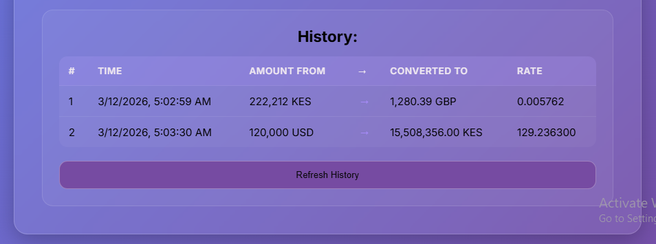

# Currency Converter App

A simple, responsive **currency converter** web application that fetches real-time exchange rates and keeps a history of your conversions. 
Built as a practice project to learn testing, CI/CD, and modern JavaScript workflows.

## Live Demo
🌐  https://wanjirungari2.github.io/redian-intvw/ 

## Features
- Convert any amount between two currencies using real-time rates from ExchangeRate-API (supports 160+ currencies)
- Manual text inputs for amount, "From" currency (e.g. KES), and "To" currency (e.g. USD)
- Instant result display after clicking Convert
- Conversion history in a scrollable, responsive table (#, Time, From → To, Rate)
- "Refresh History" button to view/update history
- Modern UI: glassmorphism card, gradient background, hover effects, mobile-friendly layout
- Automatic deployment to GitHub Pages via GitHub Actions
- Unit tests for core conversion logic using Jest


## Screenshot




## Tech Stack
- HTML5  and CSS3 — custom glassmorphism + responsive design
- JavaScript (ES6+) — async/await, fetch, DOM manipulation, modular code
- ExchangeRate-API v6 (free tier) for live exchange rates
- LocalStorage API for persistence of conversion history across sessions
- Jest** — unit testing conversion logic
- GitHub Actions — CI (tests) + CD (deploy to GitHub Pages)
- Project structure — separated concerns (API calls, utils, tests)


## Project Structure
    redian-intvw/
    ├── index.html # Main HTML file
    ├── index.js # Main JavaScript file (entry point and UI logic)
    ├── index.css # Styling with glassmorphism
    ├── package.json # Dependencies and scripts
    ├── .gitignore # Node modules 
    ├── .github/
    │ └── workflows/
    │ ├── test.yml # Runs Jest tests on push
    │ └── greeting.yml # Sends greeting from actions to user after they push
      └── deploy.yml # Auto-deploys to GitHub Pages
    ├── api/
    │ ├── currencyApi.js # Fetches exchange rates from API
    │ └── historyApi.js # Handles history saving
    ├── utils/
    │ └── converter.js # Pure conversion logic (tested with Jest)
    └── tests/
    └── converter.test.js # Unit tests for converter logic

## How to Use Locally
1. Clone the repo:
   ```bash
   git clone https://github.com/wanjirungari2/redian-intvw.git
   cd redian-intvw

2. (Optional) Install dependencies for testing:Bashnpm install

3. Open index.html directly in a browser
→ Best: use VS Code Live Server extension orBash
        npx live-server

4. Try it: Enter amount (e.g. 100), From (KES), To (USD), click Convert → see result & history table update

## Running Tests
This project uses Jest for unit testing the conversion logic:
        npm test

### Tests cover:
   -  basic multiplication
  -  zero values
  -  negative numbers
  -  large numbers
  -  decimal precision
  -  invalid inputs.


## GitHub Actions CI/CD
1. test.yml — Runs Jest automatically on push/PR (Node 24)
2. greeting.yml — Sends greeting from actions to user after pushing
3. deploy.yml — Deploys static site to GitHub Pages after successful tests (or manually via workflow_dispatch)


## APIs Used
### ExchangeRate-API
- Provides real-time currency conversion rates for 160+ currencies

- Free tier allows 1,500 requests per month

- Endpoint: https://v6.exchangerate-api.com/v6/{API_KEY}/latest/{CURRENCY}

### JSONPlaceholder (Testing/Demo)
- Free fake API for testing and prototyping

- Used in historyApi.js to simulate POST requests for saving conversion history

- Helps demonstrate async error handling without requiring a real backend

- Endpoint: https://jsonplaceholder.typicode.com/posts


## API Key Setup
- This project uses ExchangeRate-API with a free tier key. The key is embedded in the code (for demo purposes). 

- Inputs: Text fields (not dropdowns) so type currency codes manually (KES, USD, EUR, etc.)


## What I Learned
✅ Async JavaScript: Fetching data from external APIs with proper error handling

✅ DOM Manipulation: Dynamically rendering tables and updating UI

✅ LocalStorage: Persisting user history across browser sessions

✅ Modular Code: Separating concerns (API calls, conversion logic, UI)

✅ Testing: Writing meaningful unit tests with Jest

✅ CI/CD: Automating test runs and deployments with GitHub Actions

✅ YAML Syntax: Configuring workflows with proper indentation and structure

✅ GitHub Pages: Deploying static sites directly from a repository

##  Future Improvements
- Show last update time for exchange rates

- Add charts to visualize rate trends

- Add currency flags for better UX

- Add better responsiveness for mobile phone design


## Acknowledgements
- ExchangeRate-API for free real-time rates

- JSONPlaceholder for free fake API for testing

- GitHub Actions for free CI/CD minutes

- Jest for JavaScript testing


## Author
Damaris Ngari

Built with ❤️ as a learning project for testing, automation, and deployment workflows.

